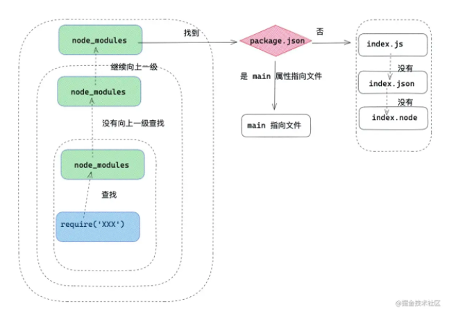

## 前言

学习`CommonJs`和`ESModule`有什么疑问呢？

* `CommonJS`和`ESModule`的区别是什么？

* `CommonJS`如何解决的循环引用问题？

* 既然有`exports`，为什么还需要`module.exports`？

* `require`模块查询机制是什么？

* `ESModule`如何解决循环引用问题？

* `exports = {}` 这种写法为何无效？

* 关于`import()`的动态引入？

* `ESModule`如何改变模块下的私有变量？

* ...
## 模块化

CommomJS和ESModule的区别可以看这篇文章的详细解答，[传送门](https://juejin.cn/post/6994224541312483336)

## require文件加载流程

以node.js作为参考

```js
const fs =      require('fs')      // ①核心模块
const sayName = require('./hello.js')  //② 文件模块
const crypto =  require('crypto-js')   // ③第三方自定义模块
```
上述代码段中：

* fs为node底层的核心模块

* ./hello.js为我们编写的文件模块

* crypto-js是通过npm下载的第三方自定义模块

当require方法执行的时候，接收的唯一参数为一个**标识符**，commonJS对不同的标识符处理流程不同，但是目的是相同的，都是找到对应的模块。

### require加载标识符原则

首先我们看一下 nodejs 中对标识符的处理原则。

* 首先像 fs ，http ，path 等标识符，会被作为 nodejs 的**核心模块**。

* ./ 和 ../ 作为相对路径的文件模块， / 作为绝对路径的**文件模块**。

* 非路径形式也非核心模块的模块，将作为自定义模块。

#### 核心模块的处理

核心模块的优先级仅次于缓存加载，在 Node 源码编译中，已被编译成二进制代码，所以加载核心模块，加载过程中速度最快。

#### 路径形式的文件模块处理

已 `./` ，`../ `和 `/` 开始的标识符，会被当作文件模块处理。`require()` 方法会将路径转换成真实路径，并以真实路径作为索引，将编译后的结果缓存起来，第二次加载的时候会更快。至于怎么缓存的？我们稍后会讲到。

#### 自定义模块处理

自定义模块，一般指的是非核心的模块，它可能是一个文件或者一个包，它的查找会遵循以下原则：

* 在当前目录下的 node_modules 目录查找。

* 如果没有，在父级目录的 node_modules 查找，如果没有在父级目录的父级目录的 node_modules 中查找。

* 沿着路径向上递归，直到根目录下的 node_modules 目录。

* 在查找过程中，会找 `package.json` 下 `main` 属性指向的文件，如果没有 `package.json` ，在 `node` 环境下会以此查找 `index.js` ，`index.json` ，`index.node`。



## require 模块引入与处理

CommonJS 模块**同步加载**并执行模块文件，CommonJS 模块在执行阶段分析模块依赖，采用深度优先遍历（depth-first traversal），执行顺序是父 -> 子 -> 父；

示例：

a.js文件

```js
const getMes = require('./b')
console.log('我是 a 文件')
exports.say = function(){
    const message = getMes()
    console.log(message)
}
```

b.js文件

```js
const say = require('./a')
const  object = {
   name:'《React进阶实践指南》',
   author:'我不是外星人'
}
console.log('我是 b 文件')
module.exports = function(){
    return object
}

```

main.js文件

```js
const a = require('./a')
const b = require('./b')

console.log('node 入口文件')
```

最终打印的结果：`我是 b 文件` ==> `我是 a 文件` ==> `node入口文件`

从上面的运行结果可以得出以下结论：

* main.js 和 a.js 模块都引用了 b.js 模块，但是 b.js 模块只执行了一次。

* a.js 模块 和 b.js 模块互相引用，但是没有造成循环引用的情况。

* 执行顺序是父 -> 子 -> 父；

### require加载原理

首先为了弄清楚上述两个问题。我们要明白两个概念，那就是 module 和 Module。

`module`：在`Node`中每一个js文件都是一个`module` ，`module`上保存了`exports`等信息之外，还有一个 `loaded` 表示该模块是否被加载。

* loaded为false，表示还没有加载

* loaded为true，表示已经加载

`Module`：以 nodejs 为例，整个系统运行之后，会用 Module 缓存每一个模块加载的信息。

简化版require源码大致如下：

```js
 // id 为路径标识符
function require(id) {
   /* 查找  Module 上有没有已经加载的 js  对象*/
   const  cachedModule = Module._cache[id]
   
   /* 如果已经加载了那么直接取走缓存的 exports 对象  */
  if(cachedModule){
    return cachedModule.exports
  }
 
  /* 创建当前模块的 module  */
  const module = { exports: {} ,loaded: false , ...}

  /* 将 module 缓存到  Module 的缓存属性中，路径标识符作为 id */  
  Module._cache[id] = module
  /* 加载文件 */
  runInThisContext(wrapper('module.exports = "123"'))(module.exports, require, module, __filename, __dirname)
  /* 加载完成 *//
  module.loaded = true 
  /* 返回值 */
  return module.exports
}
```

从上面我们总结出一次 require 大致流程是这样的：

* require 会接收一个参数——文件标识符，然后分析定位文件，分析过程我们上述已经讲到了，接下来会从 Module 上查找有没有缓存，如果有缓存，那么直接返回缓存的内容。

* 如果没有缓存，会创建一个 `module` 对象，缓存到 `Module` 上，然后执行文件，加载完文件，将 `loaded` 属性设置为 `true` ，然后返回 `module.exports` 对象。借此完成模块加载流程。

* 模块导出就是 return 这个变量的其实跟 a = b 赋值一样， 基本类型导出的是值， 引用类型导出的是引用地址。

* exports 和 module.exports 持有相同引用，因为最后导出的是 module.exports， 所以对 exports 进行赋值会导致 exports 操作的不再是 module.exports 的引用。

### require避免重复加载

从上面的例子可以直接得出，require是如何避免重复加载的，首先加载之后文件的module会被缓存到Module上

例如一个模块已经require引入了一个a模块，如果另外一个模块再次引入了a，那么会直接读取缓存值module，所以无需再次执行模块

### require避免循环引用

还是以之前的示例为主，分析流程，需要注意的一点是先加入缓存，后执行模块内容。

### require动态加载

require可以在任意的上下文中，动态加载模块，对上述提到的a.js修改

```js
console.log('我是 a 文件')
exports.say = function(){
    const getMes = require('./b')
    const message = getMes()
    console.log(message)
}
```

## exports和module.exports

exports就是传入到当前模块的一个对象，本质上就是module.exports。

为什么exports = {}直接赋值一个对象就不可以呢，实际这是js本身的特性决定的。

因为在CommonJS中，exports，module和require作为形参的方式传入到js模块中，我们直接exports = {}修改exports，等于重新赋值了形参，那么会重新赋值一份，但是不会在引用原来的形参。

### module.exports使用

module.exports本质上就是exports

由此可知，exports和module.exports持有相同的引用，因为最后导出的是module.exports。那么这就说明在一个文件中，我们最好选择exports和module.exports两者之一，如果两者存在很可能造成覆盖的情况发生。


## ES Module

从ES6开始，JavaScript才真正意义上有自己的模块化规范

优势：

* 借助 Es Module 的静态导入导出的优势，实现了 tree shaking。

* Es Module 还可以 import() 懒加载方式实现代码分割。

在 Es Module 中用 export 用来导出模块，import 用来导入模块。但是 export 配合 import 会有很多种组合情况。

### 第一种

导出模块：a.js

```js
export const name = '《React进阶实践指南》'
export const author = '我不是外星人'

export default  function say (){
    console.log('hello , world')
}
```

导入模块：main.js

第一种：

```js
import theSay , { name, author as  bookAuthor } from './a.js'
console.log(
    theSay,     // ƒ say() {console.log('hello , world') }
    name,       // "《React进阶实践指南》"
    bookAuthor  // "我不是外星人"
)
```

第二种

```js
import theSay, * as mes from './a'
console.log(
    theSay, // ƒ say() { console.log('hello , world') }
    mes // { name:'《React进阶实践指南》' , author: "我不是外星人" ，default:  ƒ say() { console.log('hello , world') } }
)
```

重命名导入

```js
import {  name as bookName , say,  author as bookAuthor  } from 'module'
console.log( bookName , bookAuthor , say ) //《React进阶实践指南》 我不是外星人
```

重定向导出

```js
export * from 'module' // 第一种方式
export { name, author, ..., say } from 'module' // 第二种方式
export {   name as bookName ,  author as bookAuthor , ..., say } from 'module' //第三种方式
```


